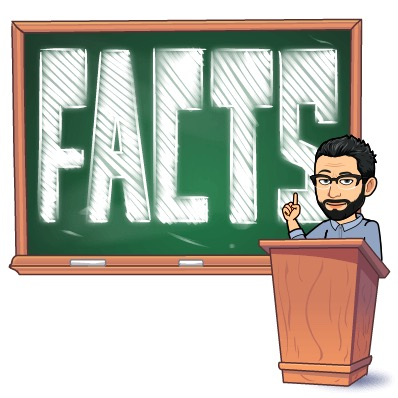

<!--  --> 

At the [College of Charleston](http://cofc.edu/), I have had the opportunity to teach courses at every level from freshman to a senior capstone course to graduate courses. Many of the courses I teach serve curriculum needs in several programs including political science, public administration, and environmental and sustainability studies. Regardless of the level, I try to guide students in becoming sophisticated users of information and engaged participants in social and political life.

### Current Courses 

<a href="/courses/capstone/" itemprop="url">**POLI 405**: Capstone: Climate Change</a>

<a href="/courses/policy602/" itemprop="url">**EVSS/PUBA 602**: Public Policy</a>

### Past Courses 

Click on the course title for a <i class="fas fa-file-pdf"></i> pdf of the most recent syllabus. 

##### Undergraduate course 

* [American Government](syllabi/AGfall18.pdf)
* [Contemporary Political Issues: Climate Change](syllabi/POLI102-syllabus-final.pdf) 
* [The Nuclear Option: The Politics of Nuclear Energy in the US](syllabi/FYEsyllabus.pdf)
* [Doing Research in Politics](syllabi/DRPsyllabus.pdf)
* [Introduction to Public Administration](syllabi/POLI210-syllabus-final.pdf)
* [Introduction to Public Policy](syllabi/POLI211-syllabus-final.pdf)
* [Environmental Policy](syllabi/EPspring19.pdf)
* [Capstone: Information and Policymaking](syllabi/CPsyllabus.pdf) 

##### Graduate 

* [Research and Management in Environmental Organizations](syllabi/RMEOspring19.pdf)
