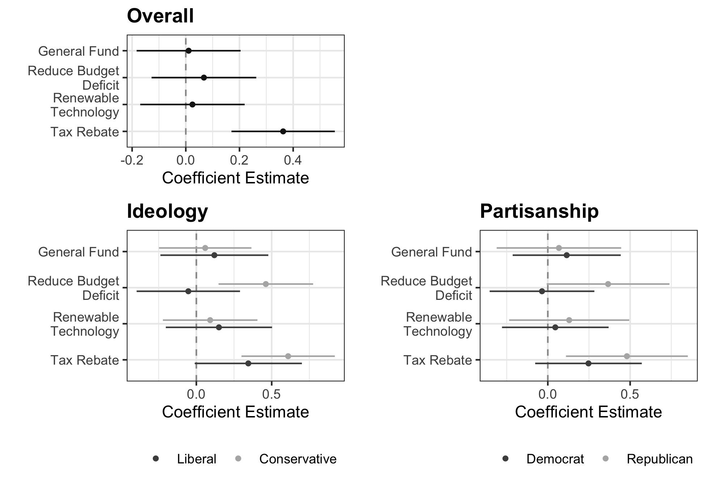

### Revenue Use and Public Support for a Carbon Tax

**Nowlin, Matthew C.**, Kuhika Gupta, and Joseph T. Ripberger. 2020. "Revenue Use and Public Support for a Carbon Tax." _Envrionmental Research Letters_, 15(8), doi: <a href="https://iopscience.iop.org/article/10.1088/1748-9326/ab92c3" itemprop="url">`10.1088/1748-9326/ab92c3`</a> 

##### Abstract 
Many experts see carbon pricing as an effective way to reduce emissions of greenhouses gases; however, political and public support for carbon pricing has faltered. Recent research indicates that revenue recycling and policy design options may induce public support for carbon pricing, but does not examine change in support as a result of revenue use or possible heterogeneity in these inducements across partisan groups. Does support for a carbon tax shift significantly once revenue uses are discussed? Do conservatives and Republicans and liberals and Democrats respond to different revenue reuse options when formulating opinions about carbon taxation? This study employs a survey experiment to examine these questions. Key results indicate that support shifts are largest when the revenue would be refunded and conservatives and Republicans are responsive to different revenue usage options. Specifically, conservatives and Republicans are more supportive of a carbon tax when revenues go towards a tax rebate or deficit reduction. While the differences are relatively small and variable (uncertain), these results provide suggestive insight into the policy design options that may induce a bipartisan basis of public support for carbon taxation policies.

##### Support for a Carbon Tax by Revenue Treatment 

