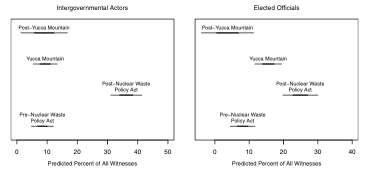

### Policy Change, Policy Feedback, and Interest Mobilization: The Politics of Nuclear Waste Management

**Nowlin, Matthew C**. 2016. "Policy Change, Policy Feedback, and Interest Mobilization: The Politics of Nuclear Waste Management." _Review of Policy Research_, 33(1): 51-70, doi: <a href="https://onlinelibrary.wiley.com/doi/abs/10.1111/ropr.12158" itemprop="url">`10.1111/ropr.12158`</a> 

##### Abstract 
Many of the leading theories of the policy process are aimed at providing insights into the factors that make policy change more (or less) likely. In general, policy change is seen as a result of shifting dynamics within policy subsystems. However, building on theories of policy feedback and interest mobilization, this article examines whether policy change, apart from being an effect of subsystem dynamics, can be a cause of shifting dynamics as latent actors are motivated to participate in the subsystem as a result of policy change. Two hypotheses regarding post-policy change mobilization are developed and tested using data on participation in congressional hearings concerning the management of nuclear waste. The findings suggest that policy change can activate latent policy actors, specifically those actors that view themselves as “losing” as a result of the policy change. These results point to the need for scholars to examine the potential impacts of post-policy change dynamics on policy development.

#####  Intergovernmental Actors and Elected Officials Predicted Participation by Policy Era

