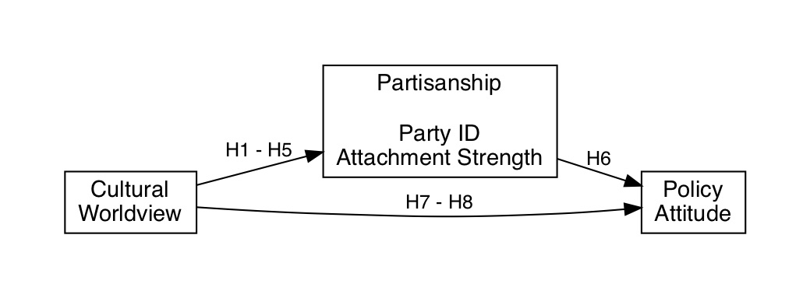
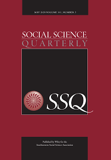

### A Cultural Theory of Partisanship and Policy Attitudes

**Nowlin, Matthew C**. and Thomas M. Rabovsky. 2020. "A Cultural Theory of Partisanship and Policy Attitudes." _Social Science Quarterly_, 101(2): 878-892, doi: <a href="https://onlinelibrary.wiley.com/doi/abs/10.1111/ssqu.12750" itemprop="url">10.1111/ssqu.12750</a> 

##### Abstract 

###### Objective 
Political parties provide an important function for a public that is generally seen as not consistently ideological by guiding its thinking about policy issues. In this article, we examine whether the four cultural worldviews derived from grid‐group cultural theory—hierarch, egalitarian, individualist, and fatalist—are predictive of partisan attachments and perceptions of climate change risk among the public.

###### Methods
Data come from an original survey of the U.S. public conducted in 2011 and 2012. We use regression analysis to examine partisanship and perceived climate change risk; ordered logit to examine party attachment; and mediation analysis to examine the mediating effect of partisanship on cultural worldviews and climate change risk.

###### Results
We find that the group‐oriented cultural types (egalitarians and hierarchs) are more likely to have stronger party attachments than the nongroup‐oriented cultural types (individualists and fatalists). In addition, we find that the mediation effect of party is more pronounced among the group‐oriented types than the nongroup oriented.

###### Conclusion
Grid‐group cultural theory is predictive of both partisanship and policy attitudes and partisanship mediates the influence of cultural worldviews on climate change risk, particularly for those types with group orientations.

##### Theoretical Model 

<!--  --> 

<!--  -->

