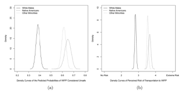
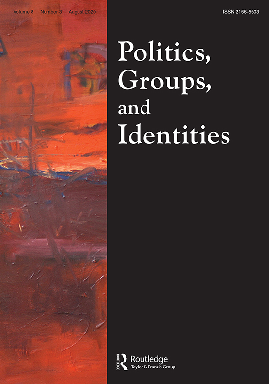

### 'Hot Rocks that Shoot Ghost Bullets': Native American Perceptions of a Nuclear Waste Facility.

**Nowlin, Matthew C**. and Thaddieus W. Conner. 2019. "'Hot Rocks that Shoot Ghost Bullets': Native American Perceptions of a Nuclear Waste Facility." _Politics, Groups, and Identities_, 7(1): 21-38, doi: <a href="https://www.tandfonline.com/doi/abs/10.1080/21565503.2017.1304222" itemprop="url">`10.1080/21565503.2017.1304222`</a> 

##### Abstract 
Environmental justice concerns are raised when environmental risks and hazards are inequitably distributed across society. Native American populations have long been at the center of environmental justice disputes, however relatively little quantitative research has examined how Native Americans view the risks related to the siting of a potentially hazardous facility. Combining 35 statewide surveys collected from 1990 to 2001, the following study explores the risk perceptions of Native American populations in New Mexico regarding the storage of nuclear waste. We find that Native Americans tend to have higher perceptions of risk regarding the Waste Isolation Pilot Plant (WIPP) facility than white respondents. We also explore variation within self-identified Native American respondents and find that older males tended to perceive less risk associated with WIPP and Native American respondents in counties with Navajo reservations tended to perceive more risk. These findings help in understanding how Native Americans perceive risk as it relates to environmental and energy issues.

##### Risk Perceptions of a Nuclear Waste Facility 

<!--  --> 

