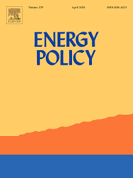

### Tracking the Nuclear 'Mood’ in the United States: Introducing a Long Term Measure of Public Opinion About Nuclear Energy Using Aggregate Survey Data 

##### Abstract 
This study uses aggregate polling data to develop and validate a new measure of public support for nuclear energy that allows for the identification of factors that influence the evolution of opinion over relatively long periods of time. In addition to focusing events, such as a significant accident, this new measure shows that energy security risk has consistently driven support for nuclear energy in the US. When oil, gas, and coal were relatively expensive and scarce, support for nuclear energy went up, and when they were relatively inexpensive and abundant, it fell. This finding adds important nuance to our understanding of public support for nuclear energy in the past, and the prospects for a new “nuclear renaissance” in the future.

Gupta, Kuhika, **Matthew C. Nowlin**, Joseph T. Ripberger, Hank Jenkins-Smith, and Carol Silva. 2019. "Tracking the Nuclear 'Mood' in the United States: Introducing a Long Term Measure of Public Opinion about Nuclear Energy Using Aggregate Survey Data." _Energy Policy_, 133