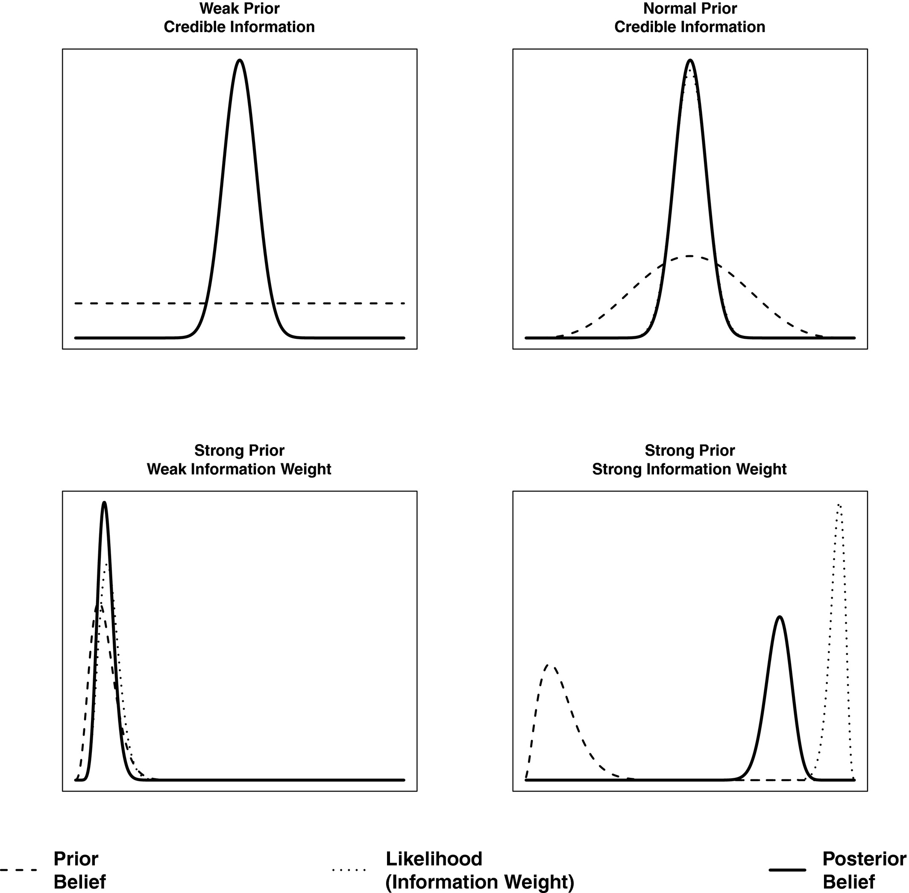

### Policy Learning and Information Processing 

**Nowlin, Matthew C**. 2020. "Policy Learning and Information Processing" _Policy Studies Journal_, forthcoming, doi: <a href="https://doi.org/10.1111/psj.12397" itemprop="url">`10.1111/psj.12397`</a> 

##### Abstract 
Policy learning is an important concept in the study of policymaking, yet it is difficult to model and empirically estimate. Additionally, work on policy learning has not fully drawn from the work on information processing in the policy process. In this paper, I propose a model of policy learning that incorporates the Advocacy Coalition Framework's notion of policy‐oriented learning and the theory of disproportionate information processing within a Bayesian learning framework. Policy learning through Bayesian updating occurs as individuals adjust their prior beliefs in light of new information, and in the approach posited here, learning is a function of the strength of prior beliefs and the weight given to new information. Additionally, learning is thought to occur only when subsequent beliefs move in the direction of the information. Then, I demonstrate the policy learning model using public opinion data about Yucca Mountain, a proposed repository site for nuclear waste. Finally, I conclude with suggesting ways in which the policy learning model can be incorporated into current policy learning theories and frameworks.

##### Stylized Examples of Policy Learning with Probability Distributions of Beliefs and Information Weights

