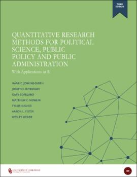

### Quantitative Research Methods for Political Science, Public Policy, and Public Administration 

Jenkins-Smith, Hank C., Joseph T. Ripberger,  Gary Copeland, **Matthew C. Nowlin**,  Tyler Hughes, Aaron L. Fister, and Wesley Wehde. 2017. _Quantitative Research Methods for Political Science, Public Policy, and Public Administration_. University Libraries, University of Oklahoma. SHAREOK, Open Education Resource, doi:  <a href="http://dx.doi.org/10.15763/11244/52244" itemprop="url">10.15763/11244/52244</a>  

##### About 
The focus of this book is on using quantitative research methods to test hypotheses and build theory in political science, public policy and public administration. It is designed for advanced undergraduate courses, or introductory and intermediate graduate-level courses. The first part of the book introduces the scientific method, then covers research design, measurement, descriptive statistics, probability, inference, and basic measures of association. The second part of the book covers bivariate and multiple linear regression using the ordinary least squares, the calculus and matrix algebra that are necessary for understanding bivariate and multiple linear regression, the assumptions that underlie these methods, and then provides a short introduction to generalized linear models. The book fully embraces the open access and open source philosophies. The book is freely available in the SHAREOK repository; it is written in R Markdown files that are available in a public GitHub repository; it uses and teaches R and RStudio for data analysis, visualization and data management; and it uses publicly available survey data (from the Meso-Scale Integrated Socio-geographic Network) to illustrate important concepts and methods. We encourage students to download the data, replicate the examples, and explore further! We also encourage instructors to download the R Markdown files and modify the text for use in different courses.

For more information and reviews see [here](https://open.umn.edu/opentextbooks/textbooks/quantitative-research-methods-for-political-science-public-policy-and-public-administration-with-applications-in-r-3rd-edition)

