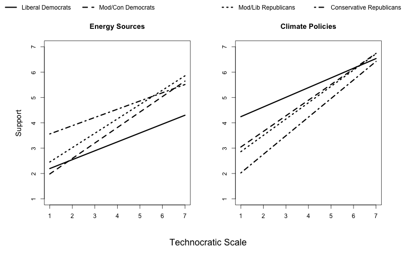

### Political Beliefs, Views about Technocracy, and Energy and Climate Policy Preferences

**Nowlin, Matthew C.**. 2020. "Political Beliefs, Views about Technocracy, and Energy and Climate Policy Preferences." _Public Understanding of Science_, forthcoming, doi: <a href="https://doi.org/10.1177/0963662520978567" itemprop="url">`10.1177/0963662520978567`</a>  

##### Abstract 
The use of technocratic decision-making, where policy decisions are made by elite experts, is an important aspect of policymaking in the United States. However, little work has examined public opinion about technocracy. Using data from a representative sample of the United States (n = 1200), I explore differences in support for technocracy and the implications of that support for views about politically controversial energy sources and climate policies. Overall, I find that liberal Democrats, moderate/conservative Democrats, and moderate/liberal Republicans were more likely than conservative Republicans and moderate independents to support technocratic decision-making. In addition, I find that as support for technocracy increases, so does support for energy sources and climate policies; however, there are significant interaction effects across political beliefs.

##### Support for Energy Sources by Political Beliefs and Technocratic Views

